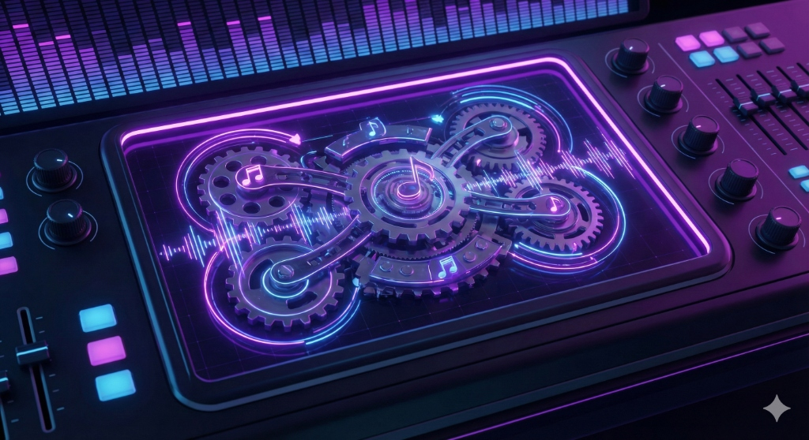

# House Production Suite (v1.0.0)

A collection of modern VST3 plugins for House music production, featuring a "High-Contrast Industrial" Teenage Engineering-inspired aesthetic. Built with JUCE 8 and C++20.



## Plugins

### 🥁 RhythmEngine (TE-STEP v2.0)
A specialized drum synthesizer with a step sequencer and punch-in effects.
*   **Voices:** Synthesized Kick, Bass, Hat, and Clap.
*   **Step Modifiers:** TE-style logic gates (Ratchet, Skip Cycle, First Cycle Only) per step.
*   **Punch-In FX:** Momentary "Stutter", "Filter Sweep", and "Bitcrush" effects with visual feedback.
*   **Features:**
    *   Sidechain Ducking (Bass ducks when Kick triggers).
    *   Lock-free audio engine for Ableton Live stability.
    *   High-contrast OLED black UI with neon red accents.

### 🎹 MelodyEngine (TE-SYNTH v2.0)
A polyphonic wavetable synthesizer with step sequencing capabilities.
*   **Engine:** Wavetable synthesis with Morph, Cutoff, and Resonance control.
*   **Smoothing:** `juce::SmoothedValue` implementation for zipper-free automation.
*   **Logic:** Supports TE-style step modifiers for complex evolving patterns.
*   **UI:** High-contrast OLED black UI with neon green accents and vector controls.

## Prerequisites

*   **OS:** Windows 10/11
*   **Build Tools:** Visual Studio 2022+ with C++ CMake tools.
*   **CMake:** Version 3.22+

## Building

This project uses a custom batch script for a one-click build experience using Ninja.

1.  **Open Command Prompt** (or VS Developer Command Prompt).
2.  **Run the build script:**
    ```cmd
    build_plugins.bat
    ```

This will fetch JUCE 8.0.0 and compile optimized Release builds to `build/plugins/`.

## Project Structure

*   `plugins/`: Source code for VST3 plugins.
*   `modules/`: Shared internal JUCE modules (`djstih_dsp`) and LookAndFeel.
*   `shared/`: Common UI assets (`TELookAndFeel.h`).
*   `CMakeLists.txt`: Root build configuration.

## License

MIT License. See [LICENSE](LICENSE) for details.
